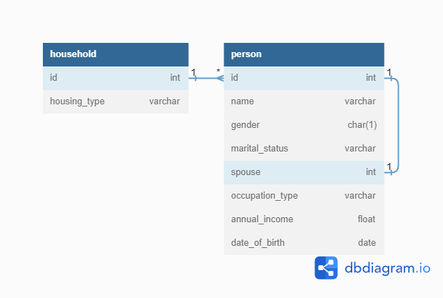

# Project Requirements
---
This document outlines the requirements of the API as understood by myself and lists any assumptions made. It also defines keywords that may be referenced later on in the document.

## Definitions

- Child: Person of age < 18 years
- Adult: Person of age >= 18 years and <= 55 years
- Elder: Person of age > 55 years

## End-points

```markdown
1. Create Household
    Type: 'POST'
    Params: 
        String: 'Housing Type' => {'Landed', 'Condominium', 'HDB'}

2. Add a family member to household
    Type: 'POST'
    Params:
        String: 'Name'
        String: 'Gender' => {'M', 'F'} 
        [Assumption: M/F only]
        String: 'MaritalStatus' => {'Single', 'Married', 'Divorced'}
        [Assumption: Lack of spacing between 'Marital' and 'Status' is intentional, similar assumptions made for other variables regarding spacing as referenced from assignment document]
        [Assumption: Single/Married/Divorced]
        Integer: 'Spouse'
        [Assumption: Primary key of 'Persons' table]
        String: 'OccupationType' => {'Unemployed', 'Student', 'Employed'}
        Integer: 'AnnualIncome'
        Date: 'DOB'

3. List all households
    Type: 'GET'
    Params: None
    Response Format:
        Array: [
            Object: {
                Integer: 'HouseholdId',
                String: 'HouseholdType',
                [Assumption: 'HouseholdType' assumed to refer to 'Housing Type']
                Array: 'Family Members' [
                    {
                        String: 'Name'
                        String: 'Gender'
                        String: 'MaritalStatus'
                        Integer: 'Spouse'
                        String: 'OccupationType'
                        Integer: 'AnnualIncome'
                        Date: 'DOB'
                    },
                    ...
               ]
            },
           ...
        ]

**TODO: Add more params that are relevant**
4. Search for a specific household
    Type: 'GET'
    Params:
        String: 'HouseholdType'
        Integer: 'Total Family Members'
        Integer: 'Total Annual Income'
        Boolean: 'Has Student'
        Boolean: 'Has Elder'
        [Assumption: Search params are not given in the assignment docs. I have included a list of search params I believe are useful, especially if they are related to the grants]
    Response Format:
        Same as endpoint 3, but only inclusive of the items that match the search params
        [Assumption: Since this is a search endpoint, it returns all the households which match the params given (AND-Based Matching, i.e. all given params must match)]

5. List the households and qualifying family members of a grant disbursement
    Type: 'GET'
    Params:
        String: 'Grant Type' => {'Student Encouragement Bonus', 'Multigeneration Scheme', 'Elder Bonus', 'Baby Sunshine Grant', 'YOLO GST Grant'}
    Response Format:
        Same as endpoint 3, but only inclusive of the households and their respective qualifying members of a given grant 

```

## Schemes

```markdown
1. Student Encouragement Bonus
    Criteria:
    - At least one student with age < 16 years old
    Qualifying:
    - All students < 16 years old
    [Assumption: The qualifying member must also be a student (not stated in assignment docs)]

**TODO: Clarify Requirements**
2. Multigeneration Scheme
    - ???

3. Elder Bonus:
    Criteria:
    - HDB Household
    - At least one member > 55 years old
    [Assumption: Conflicting information in assignment docs - "above the age of 55" and ">= 55 years old" are both stated. I am assuming this is a typo, and it should be instead "> 55 years old".]
    Qualifying:
    - All members > 55 years old

4. Baby Sunshine Grant
    Criteria:
    - At least one member < 8 months old
    Qualifying:
    - All members < 8 months old

5. YOLO GST Grant
    Criteria:
    - HDB Household
    - Total annual income < $100,000
    Qualifying:
    - All members
```

## Database Schema

The database schema is as shown in the following diagram:


<em>Note: person.spouse to person.id is supposed to be 1 to [0, 1] instead of 1 to 1 as it is possible for spouse to be null<em>
